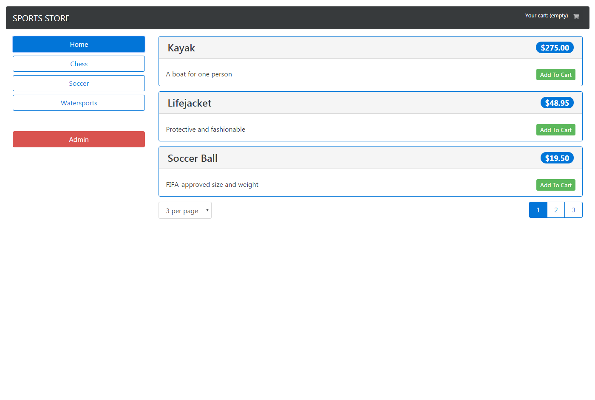
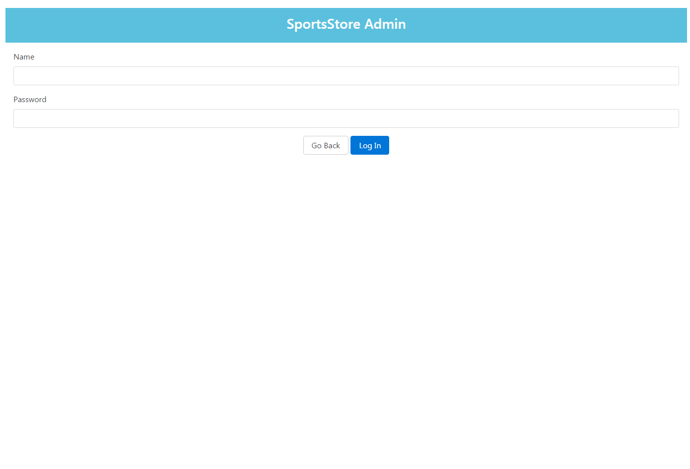
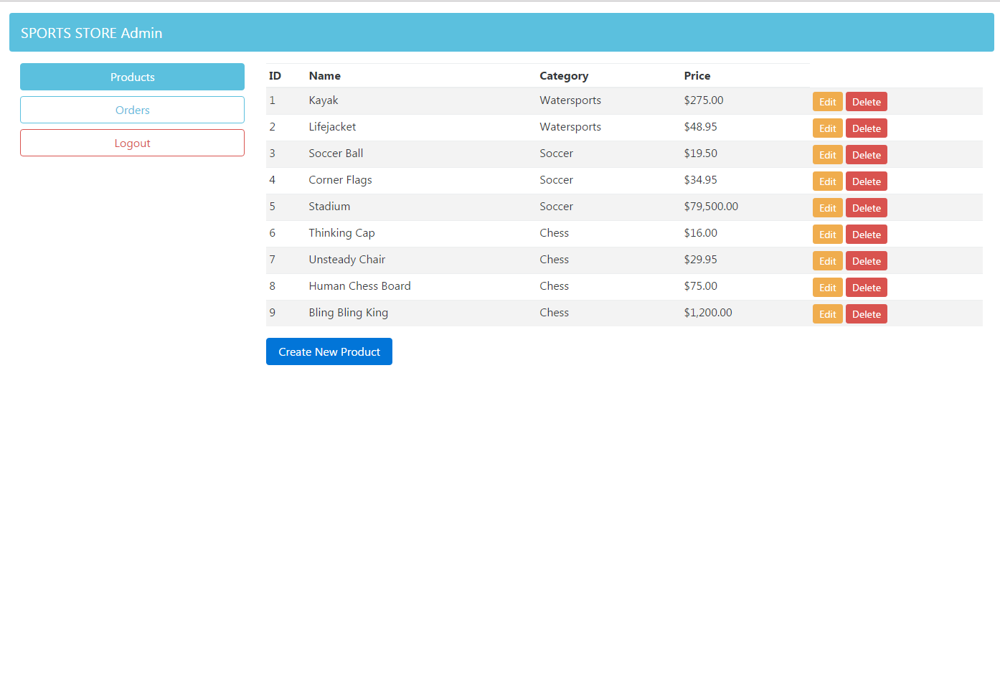

# SportStore

该项目是[Pro Angular2]书中的演示项目，我又手动实现了一遍。项目初始化时采用了[Angular CLI](https://github.com/angular/angular-cli)脚手架。

## Development server 开发服务器

前端服务器会允许在4200端口上，使用`npm run serve`后启动。后台数据我采用了`json-server`库来实现，因此需要先运行`npm run json`后启动该后台服务器，该服务器允许在3500端口上，用于mock数据。

## Run Project 运行项目

在命令行中输入`npm run start`会同时启动服务端和客户端，你也可以分别启动`npm run serve`和`npm run json`。然后访问`http://localhost:4200`。

## Build 打包

Run `npm run bundle` to build the project, which will use the rollup to bundle.
使用`npm run bundle`去打包项目，采用rollup来去除冗余代码。

## 项目截图
首页

用户认证页

用户管理页

